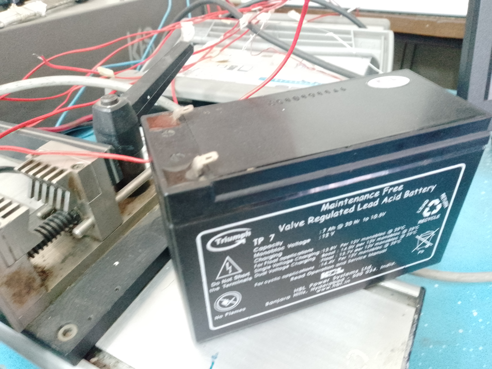
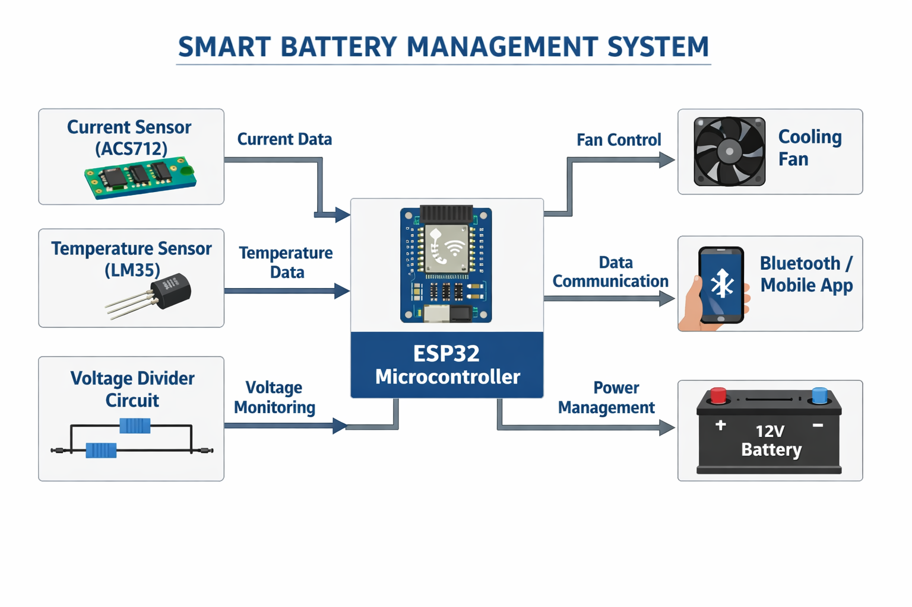

# Smart Battery Management System (BMS)

An Arduino/ESP32-based Battery Management System designed to monitor battery health in real time by measuring voltage, current, and temperature. The system supports multiple vehicle battery profiles and provides fault detection, protection mechanisms, and remote monitoring capabilities.

## Project Overview

This project was developed to improve battery monitoring and safety for various vehicle battery types, including:

* Motorcycle Batteries
* Tuk-Tuk Batteries
* Car Batteries
* Lorry Batteries

The system continuously monitors battery parameters and automatically responds to abnormal operating conditions such as overheating, overvoltage, undervoltage, and excessive current draw.

## Features

* Real-time voltage monitoring
* Real-time current monitoring
* Real-time temperature monitoring
* Multiple battery profile support
* Bluetooth communication
* Remote status monitoring
* Fault detection and protection
* Automatic cooling fan control
* Expandable architecture for IoT integration

## Hardware Components

* ESP32 / Arduino
* ACS712 Current Sensor
* LM35 Temperature Sensor
* Voltage Divider Circuit
* Cooling Fan
* Battery Under Test
* Bluetooth Communication Module (ESP32 Built-in)

## System Architecture

1. Sensors collect battery data.
2. ESP32 processes measurements.
3. Battery profile limits are applied.
4. Protection logic evaluates system status.
5. Alerts and cooling actions are triggered when required.
6. Data is transmitted for monitoring via Bluetooth.

## Battery Parameters Monitored

| Parameter   | Purpose                                        |
| ----------- | ---------------------------------------------- |
| Voltage     | Detect overvoltage and undervoltage conditions |
| Current     | Detect excessive load or charging current      |
| Temperature | Prevent overheating and thermal damage         |

## Protection Logic

The system continuously checks for:

* Overvoltage
* Undervoltage
* Overcurrent
* Overtemperature

When unsafe conditions are detected:

* Warning messages are generated
* Cooling fan is activated
* Fault status is reported to the monitoring system

## Communication Commands

### Set Battery Type

```text
set_type motorcycle
set_type tuktuk
set_type car
set_type lorry
```

### Get System Status

```text
get_status
```

## Example Output

```json
{
  "battery_type": "car",
  "voltage": 12.6,
  "current": 4.2,
  "temperature": 29.5,
  "fan_status": "OFF",
  "fault": "NONE"
}
```

## Applications

* Vehicle Battery Monitoring
* Battery Testing Stations
* Solar Energy Storage Systems
* Fleet Management
* Educational and Research Projects
* Battery Refurbishment and Revival Systems

## Future Improvements

* Mobile Application Integration
* Cloud Data Logging
* Predictive Battery Health Analysis
* GPS Tracking Integration
* Automatic Battery Balancing
* Advanced Battery Diagnostics

## Project Images

### System Overview

 


### Hardware Setupk



### Mobile Application


## Author

Dennis Kyule Muli

Electrical Engineer | Embedded Systems Developer | IoT Enthusiast

## License

This project is open for educational and demonstration purposes.
